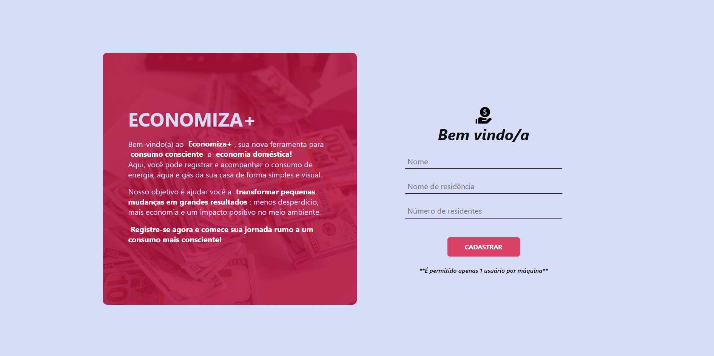
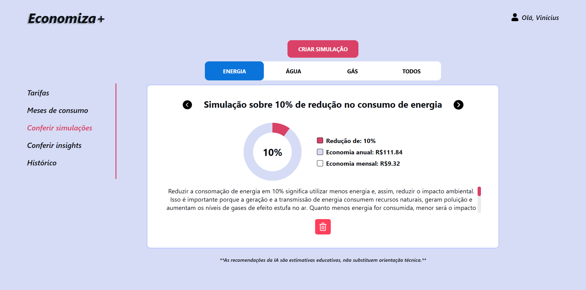
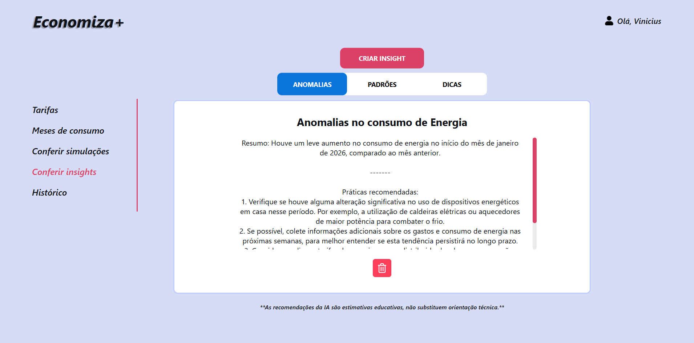

# 💡 Economiza+ — Plataforma de Monitoramento de Consumo Doméstico

O **Economiza+** é uma plataforma digital **simples, educativa e totalmente offline** voltada ao **monitoramento do consumo doméstico de energia, água e gás**.  
O sistema ajuda famílias e comunidades a **entender seus hábitos de consumo**, **simular economias**, **visualizar impactos financeiros e ambientais** e receber **insights gerados por IA local**, sem depender de internet.

Tudo roda **localmente**, inclusive a **Inteligência Artificial**, utilizando **Ollama com modelos open-source leves**.

---




## Tudo acontece localmente

- **Privacidade total** — nenhum dado sai da máquina  
- **Sem uso de nuvem**  
- **Baixa latência**  
- **Funciona offline**  
- Ideal para **comunidades com acesso limitado à internet**


## Propósito do projeto

O Economiza+ foi desenvolvido como uma **atividade extensionista**, alinhada ao **ODS 12 — Consumo e Produção Responsáveis**, com foco em:

- **Educação ambiental prática**
- **Consciência sobre gastos domésticos**
- **Inclusão digital**
- Uso real em **famílias, escolas, ONGs e comunidades**

A proposta é transformar **dados de consumo** em **informação clara**, acessível e útil para a tomada de decisão no dia a dia.


## Funcionalidades principais
- Cadastro simples de perfil residencial
- Registro mensal de consumo:
  - Energia elétrica (kWh)
  - Água (m³)
  - Gás (m³)
- Visualização de histórico de consumo
- Configuração de tarifas (energia, água e gás)
- Projeções de gastos futuros
- **Simulações de economia** com redução de consumo
- Visualização de impacto ambiental estimado
- **Insights gerados por IA local**, incluindo:
  - Anomalias
  - Padrões de consumo
  - Dicas educativas
- Exportação de relatórios em **PDF**

---


---



## Uso consciente de IA

A Inteligência Artificial no Economiza+:

- roda **100% localmente**
- utiliza apenas **dados do próprio usuário**
- **não é um chatbot**
- atua como **apoio educativo**

> **As recomendações da IA são estimativas educativas e não substituem orientação técnica.**


## Modelagem de Dados (MySQL local)

O sistema utiliza **MySQL local**, com uma modelagem simples e bem definida:

- Usuários
- Consumos mensais
- Tarifas
- Simulações
- Insights da IA
- Histórico de exportações

Todos os dados permanecem **exclusivamente na máquina do usuário**.


## Estrutura do Backend (Node + TypeScript)

O backend segue uma **arquitetura em camadas**, priorizando organização, manutenibilidade e clareza.
- **Node.js + TypeScript**
- **Express**
- **Sequelize + MySQL**
- **Jest**
- **PDFKit** para geração de PDF
- **UUID** para identificadores locais
- **Helmet** + **HPP** + **Compression** + **CORS** para segurança e otimização
- **Arquitetura limpa**:
  - Controllers
  - Services (regras de negócio)
  - Repositories
  - Domain (entidades)
- **IA local - Ollama mistral**


## Estrutura do Frontend (React + TypeScript)

Frontend focado em **simplicidade, acessibilidade e clareza visual**, seguindo princípios de IHC.
- **React + TypeScript**
- **Vite**
- **Axios**
- **React Router DOM 7**
- **Context API** para gerenciamento de sessão
- **Componentização por feature**
- **Interface simples e intuitiva**
- **Fluxos curtos e guiados**
- **Feedback visual de erros e carregamento**


## Requisitos Funcionais (resumo)

- Cadastro de perfil residencial
- Registro de consumo mensal
- Visualização de gráficos e histórico
- Configuração de tarifas
- Projeções de gastos
- Simulações de economia
- Geração de insights com IA local
- Exportação de relatórios em PDF
- Operação totalmente offline


## Requisitos Não Funcionais

- Operação offline
- Respostas rápidas (≤ 3s para IA)
- Baixo consumo de hardware
- Interface acessível e simples
- Privacidade total dos dados
- Código modular e manutenível
- Curva de aprendizado < 5 minutos


## Objetivo Open-Source

O Economiza+ foi desenvolvido para ser:

- **Educativo**
- **Fácil de entender**
- **Fácil de modificar**
- **Aberto para contribuições**
- **Aplicável em contextos sociais reais**

Possíveis evoluções futuras:

- Tema claro/escuro
- Versão mobile
- Suporte a novos modelos de IA local
- Modo multi-residência


## 🐋 Instalação e execução com Docker

### Pré-requisitos
Antes de iniciar o economiza+, certifique-se de possuir instalado:
- Docker Desktop
- Git

> Todos os outros serviços são executados em containers Docker.

---

### Clonar o projeto
```bash
- git clone https://github.com/Viniciusrodd/EconomizaMais.git

- cd Economiza+
```

---

### Primeira execução
Na primeira execução é necessário baixar o modelo utilizado pela IA.
Abra a pasta `launcher` e execute:
```
install.bat
```

O instalador irá:
- iniciar todos os containers
- baixar o modelo `mistral:7b-instruct-q4_0`

> O primeiro download pode levar alguns minutos, dependendo da velocidade da internet.

---

### Executando a aplicação
Após a instalação inicial, basta executar:
```
start.bat
```
O script irá:
- iniciar todos os containers
- abrir automaticamente o navegador em
```
http://localhost:3000
```

---

### Encerrando a aplicação
Quando terminar de utilizar o economiza+, execute:
```
stop.bat
```
Esse script interrompe todos os containers da aplicação, liberando memória e processamento da máquina.


## ⚠️ Requisitos de hardware
- 8 GB de RAM (mínimo)
- 16 GB de RAM (recomendado)
- CPU com múltiplos núcleos
- Aproximadamente 8 GB de espaço livre para os modelos e imagens Docker


## 🚀 Instalação e execução local (outra opção)
> ⚠️ **Observação**: o sistema permite **apenas 1 usuário por máquina**, pois funciona localmente e offline.

---

### Pré-requisitos
- **✔ Node.js (LTS)**  
  https://nodejs.org/en/download  
- **✔ Git**  
  https://git-scm.com/downloads  
- **✔ MySQL local**
- **✔ Ollama**  
  https://ollama.com/download  

---

### Download ZIP (recomendado para usuários leigos)
- Clique em **Code → Download ZIP**
- Extraia o projeto em uma pasta local  
  Exemplo:
  ```text
  C:\Users\alfa\Documents\Economiza+

ou

### Clonando o repositório via Git
```bash
git clone https://github.com/Viniciusrodd/EconomizaMais.git
cd economiza+
```

---

### Configurar o banco de dados
O Economiza+ utiliza **MySQL local**.

Antes da primeira execução, é necessário criar o banco.

Abra o MySQL e execute:

```bash
CREATE DATABASE economiza+;
```

Configure o arquivo .env em backend/.env:
```bash
DB_NAME=economiza+
DB_USER=seu_usuario
DB_PASSWORD=sua_senha
DB_HOST=localhost
SERVER_PORT=5115  
```

---

### Instale tudo com 1 clique
Na pasta raiz do projeto, execute:
```bash
install_economizaMais.bat
``` 
Esse instalador irá:
- ✔️ Verificar se Node.js está instalado
- ✔️ Verificar se NPM está disponível
- ✔️ Verificar se Ollama está instalado
- ✔️ Instalar dependências do backend
- ✔️ Instalar dependências do frontend

Caso algo esteja faltando, o instalador exibirá exatamente o que precisa ser instalado.

---

### Iniciando o sistema (modo automático)
Após a instalação, execute:
```bash
start_economizaMais.bat
```

Esse script irá:
- Iniciar o backend
- Iniciar o frontend
- Criar automaticamente um atalho na área de trabalho (na primeira execução)
- Abrir o navegador automaticamente em:
>http://localhost:5173/
- Encerrar serviços antigos caso as portas estejam ocupadas

Você verá duas janelas abertas:
```bash
- 1 — Economiza+ Backend (Node + Express)
- 2 — Economiza+ Frontend (React + Vite)
```
⚠️ Não feche essas janelas enquanto estiver usando o sistema.

---

### Acessando o sistema manualmente
Abra no navegador:
```bash
http://localhost:5173/
```

---

### Como parar o sistema
Em cada terminal:

```bash
CTRL + C
```

---

### 🧪 Execução manual (opcional – modo desenvolvedor)
Caso prefira rodar manualmente:

#### Backend
```bash
cd backend
npm install
npm run dev
```

#### Frontend
```bash
cd frontend
npm install
npm run dev
```


## Problemas comuns

### ❌ IA não responde
- Verifique se o **Ollama está rodando**
- Confirme se o modelo foi baixado corretamente

### ❌ Porta já está em uso
- O script tenta resolver automaticamente, mas se necessário:
```bash
taskkill /IM node.exe /F
```

### ❌ Erro de conexão com banco
- Verifique se o **MySQL local está ativo**
- Confirme variáveis no *.env*


## Contribuições e suporte
Sinta-se à vontade para:
- Abrir issues
- Sugerir melhorias
- Enviar PRs
- Adaptar o projeto para sua comunidade
